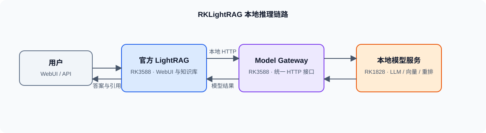
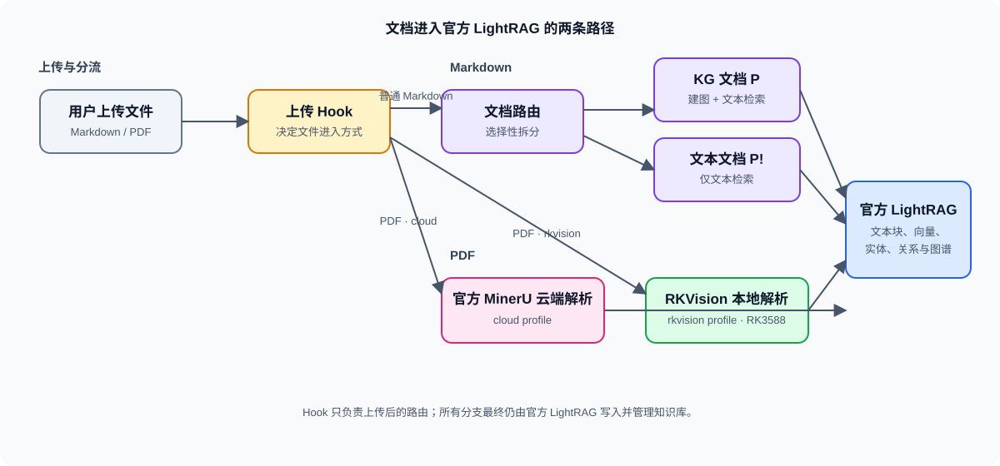

# RKLightRAG Deployment

基于 [HKUDS/LightRAG](https://github.com/HKUDS/LightRAG) 的 RK3588 + RK1828 本地部署编排仓库。

LightRAG 负责 WebUI、文档入库、知识图谱、检索和数据存储；RK3588 负责服务编排，RK1828 提供本地模型推理。本仓库维护两者之间的 gateway、文档路由、PDF 视觉解析和 LightRAG Hook，不保存模型权重或知识库数据。

部署步骤见 [安装文档](docs/install.md)，环境变量与配置文件说明见 [环境配置](docs/environment.md)。

日常部署脚本说明见 [scripts/README.md](scripts/README.md)。

## 一、总体架构

LightRAG 只访问 RK3588 上的 Model Gateway；gateway 负责将请求转给 RK1828 的本地模型服务。知识库数据始终由 LightRAG 保存。

## 二、文档入库

上传 Hook 只决定文件进入 LightRAG 的方式：Markdown 会拆成建图与仅检索两类内容；PDF 根据部署配置选择 MinerU 云端或 RKVision 本地解析。各分支最终均进入官方 LightRAG 入库。

## 三、对官方 LightRAG 的扩展

| 扩展 | 修改位置 | 作用 |
| --- | --- | --- |
| Markdown 上传路由 | `document_routes.py` | 将普通 `.md` 拆为 `*.kg.[-P].md` 与 `*.text.[-P!].md`。 |
| 文档分组 | `document_routes.py` | 在 WebUI 中将同源 P/P! 文档显示为一条，并支持一起删除。 |
| 查询 FIFO | `query_routes.py` | LLM 请求串行执行；队满时返回 `429`。 |
| 排队状态 | `query_routes.py` + WebUI | 显示当前请求的运行或排队状态，不暴露其他用户的问题。 |

扩展安装器只支持 `deploy/lightrag-upstream.env` 中固定的上游提交；升级 LightRAG 前需重新验证 Hook。

## 四、组件仓库

| 组件 | 仓库 | 作用 |
| --- | --- | --- |
| PPOCRv6 RKNN | [RK3588-ppocrv6-service](https://github.com/Eliasyuan-bit/RK3588-ppocrv6-service) | 文字检测、方向分类、文字识别 |
| DocLayout-YOLO RKNN | [RK3588-docling-service](https://github.com/Eliasyuan-bit/RK3588-docling-service) | 文档版面区域识别 |
| Qwen3.5-9B 两卡服务 | [RK1828-qwen3.5-9b-2cards-service](https://github.com/Eliasyuan-bit/RK1828-qwen3.5-9b-2cards-service) | 本地 LLM 服务 |
| Embedding / Reranker | [RK1828-qwen3-embedding-reranker-service](https://github.com/Eliasyuan-bit/RK1828-qwen3-embedding-reranker-service) | 本地向量与重排服务 |

四个模型服务以 Git submodule 固定版本；本仓库 `core/` 保存非模型的编排与适配代码。
