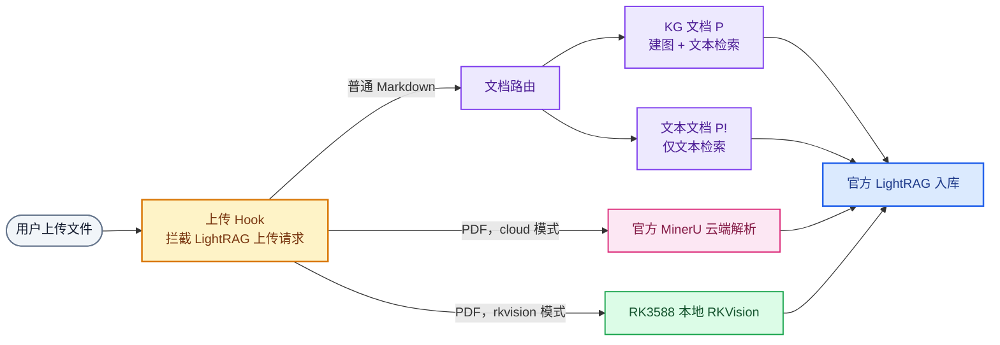
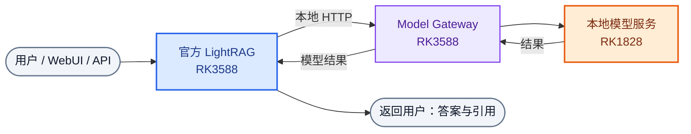

# RKLightRAG Deployment

基于 **官方 LightRAG** 的 RK3588 + RK1828 本地部署编排仓库。

本仓库不保存模型权重、文档数据或运行时知识库。除四个独立的模型服务外，模型网关、入库路由、PDF/视觉编排和 LightRAG 扩展均由本仓库维护。

官方 [HKUDS/LightRAG](https://github.com/HKUDS/LightRAG) 负责 WebUI、入库、建图、检索和数据存储；Model Gateway 在 RK3588 上将其本地 HTTP 请求转给 RK1828 模型服务。

部署与配置见 [安装文档](docs/install.md)。

## 系统架构

### 文档入库

上传 hook 只决定“上传后的文件如何进入官方入库管线”：它对普通 Markdown 执行选择性拆分；PDF 不拆分，而是根据部署时选择的 `cloud` 或 `rkvision` profile 调用对应解析器。无论走哪条分支，最后都是由官方 LightRAG 写入文本块、向量和知识图谱。

### 查询与模型服务

上图完成入库后，文本块、向量和知识图谱保存在 LightRAG 的 `WORKING_DIR`。下图描述用户提问时，运行在 RK3588 的同一个 LightRAG 如何通过 Model Gateway 使用 RK1828 模型服务；它不会再次经过上传 Hook 或 PDF 解析器。

两张图对应同一套系统的入库与查询阶段：索引、图谱和缓存均由官方 LightRAG 保存；本仓库只提供 RK3588/RK1828 模型适配与少量 Hook。

## 本地适配

### LightRAG Hook

Hook 仅针对固定上游提交安装；锚点不匹配时安装器会停止。

| Hook | 修改位置 | 实际作用 |
| --- | --- | --- |
| `selective_ingest_router.py` + upload hook | `document_routes.py` 的 Markdown 上传路径 | 普通 `.md` 拆成 `*.kg.[-P].md` 与 `*.text.[-P!].md`；前者参与实体关系抽取与图谱，后者只保留文本向量检索。显式带 `.[...]` 提示的文件仍走官方原路径。 |
| document grouping hook | `document_routes.py` 的文档列表和删除接口 | 将同源的 P/P! 内部文档折叠为 WebUI 中的一条用户文档；删除这一条时同时删除两个内部文档。 |
| query FIFO gate hook | `query_routes.py` 的普通与流式查询接口 | 在 LightRAG 进模型前设置全局单活跃查询队列，队满返回 `429`；避免多个 WebUI/API 请求同时写入同一 LLM daemon。另提供 `/query/status`。 |
| queue progress hook | `query_routes.py` 的 FIFO 协调器 | 通过浏览器匿名 token 返回“当前请求运行中 / 排队中 / 前方位置”，不会向其他用户暴露问题内容。 |
| WebUI status banner hook | LightRAG 打包 WebUI 的 `index.html` | 注入 `query-status-banner.js`，将队列状态显示在当前聊天消息的响应信息区域。 |

这些 hook 不替换 LightRAG 的索引、检索、图数据库或 WebUI 主体，只在上传、文档显示、查询调度和状态呈现四处做适配。

### 查询队列

LLM 请求按 FIFO 串行执行，避免多用户输出串台；WebUI 会显示排队状态。Embedding 与 Reranker 为独立常驻服务，不会随请求重复加载。

## 组件仓库

| 组件 | 仓库 | 目录 | 作用 |
| --- | --- | --- | --- |
| PPOCRv6 RKNN | [RK3588-ppocrv6-service](https://github.com/Eliasyuan-bit/RK3588-ppocrv6-service) | `components/ppocrv6-rknn-service` | 文字检测、方向分类、文字识别 |
| DocLayout-YOLO RKNN | [RK3588-docling-service](https://github.com/Eliasyuan-bit/RK3588-docling-service) | `components/doclayout-yolo-rknn-service` | 文档版面区域识别 |
| Qwen3.5-9B 两卡服务 | [RK1828-qwen3.5-9b-2cards-service](https://github.com/Eliasyuan-bit/RK1828-qwen3.5-9b-2cards-service) | `components/RK1828-qwen3.5-9b-2cards-service` | Qwen3.5 常驻推理 |
| 向量模型 | [RK1828-qwen3-embedding-reranker-service](https://github.com/Eliasyuan-bit/RK1828-qwen3-embedding-reranker-service) | `components/RK1828-qwen3-embedding-reranker-service` | Qwen3 Embedding / Reranker 常驻推理 |

四个模型服务以 Git submodule 固定版本；其余编排代码位于本仓库 `core/`。
