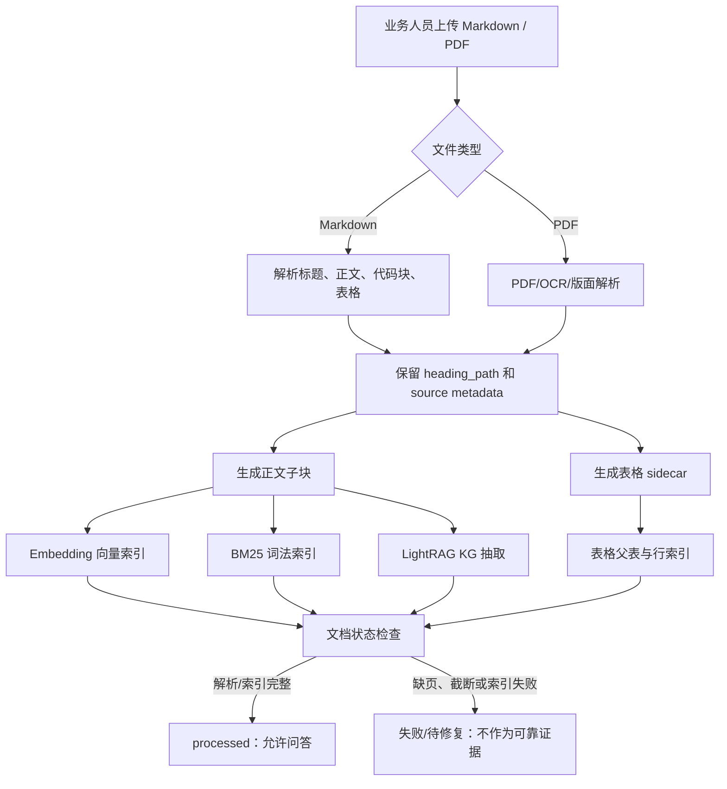
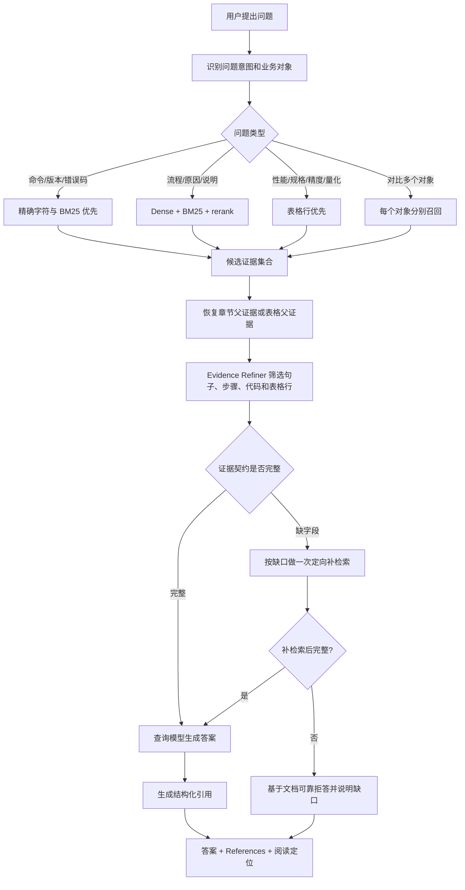
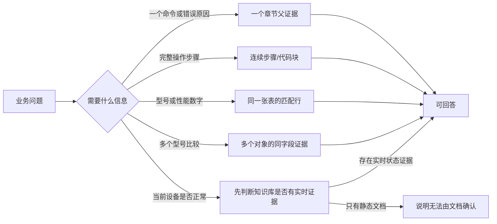
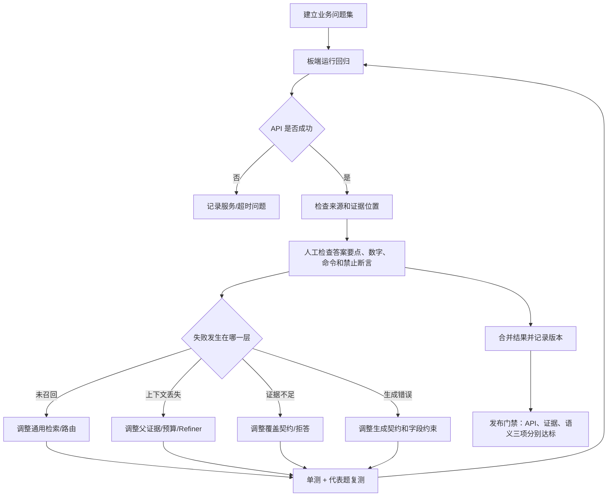

# 当前 RAG 实现与改进说明

更新日期：2026-09-21。

本文是当前仓库 RAG 系统的实现说明和阶段性验收记录，面向后续维护、复测和问题定位。
它描述已经落地的通用能力，不把某个问题的答案硬编码进检索或提示词，也不把 HTTP 成功
率当作语义正确率。

## 1. 两类 RAG 查询流程

这里的 `naive` 指 **Naive RAG（传统/朴素 RAG）**，不是 `native`。第一张图说明当前
主流向量 RAG 的基本链路，第二张图说明本项目使用的图增强混合链路。后者是 LightRAG
`mix` 模式的工程流程，不应与某个厂商的特定 GraphRAG 产品实现混为一谈。

### 1.1 主流 Naive RAG

[](rag-query-flow-comparison.html)

上图也提供[独立 HTML 展示页](rag-query-flow-comparison.html)，便于浏览器全屏展示或导出图片。

Naive RAG 的核心是“把问题和文本块放进同一个向量空间，再寻找相似内容”。它通常只有
最终回答这一次 LLM 调用；reranker 是否启用取决于准确率和延迟要求。

### 1.2 当前图增强混合 RAG

两者的主要区别不是“有没有向量库”，而是 Graph/Hybrid RAG 在向量检索之外，还要把
自然语言问题映射成适合图谱查询的实体、关系和主题入口：

| 对比项 | Naive RAG | 当前 LightRAG `mix` |
| --- | --- | --- |
| 查询入口 | 原问题的 embedding | 原问题 + 高/低层关键词 |
| 召回来源 | 主要是向量文本块 | Dense、BM25、实体和关系图谱 |
| 第一次 LLM | 通常不需要 | 默认用于查询理解和关键词结构化 |
| 候选处理 | Top-K，可选 rerank | 多路候选融合、rerank、父证据恢复 |
| 适合问题 | 局部事实、语义相似问答 | 跨实体关系、主题概览及混合业务问题 |
| 主要代价 | 链路短、延迟较低 | 多一次查询理解，检索链更复杂 |

### 1.3 第一阶段 LLM 为什么存在

图检索不能只依赖整句问题的向量相似度。例如问题同时包含型号、错误现象和原因时，图谱
需要知道哪些词是实体锚点，哪些词表示关系或全局主题。第一阶段 LLM 把问题整理成
`high_level_keywords` 和 `low_level_keywords`，使本地实体检索和全局关系检索获得稳定入口，
并减少口语表达对图谱命中的影响。

这个步骤对**当前默认 LightRAG 图检索协议**是必要输入，但“调用一次生成式 LLM”并不是
RAG 的理论必需条件：Naive RAG 可以直接做 query embedding；格式稳定的问题也可以由
规则、专用分类/实体模型或缓存产生同样的结构化输入。本项目已经对部分固定结构的性能
指标问题使用本地提取快路径，重复问题还可以命中关键词缓存。因此应把它表述为“图检索
需要查询理解结果”，而不是“所有 RAG 都必须先调用一次 LLM”。

性能统计时必须把两次 LLM 分开：第一次是检索前查询理解，第二次是基于证据生成答案。
在本次 USB 非缓存测试中，第一次为 662 输入 / 41 输出 token、约 976.4 ms；最终回答为
1188 输入 / 117 输出 token、约 2230.3 ms。

## 2. 当前结论

系统已经形成了从文档解析、混合检索、结构化证据恢复、生成前校验到引用展示的完整链路。
当前重点改进集中在两类历史问题：

- 正确的章节或表格行没有进入最终上下文；
- 证据不完整或跨行后，2B 查询模型生成了看似合理但不受支持的答案。

2026-09-20 重启板端后完成三文档 60 题回归：

| 指标 | 结果 |
| --- | ---: |
| API 正常返回 | 60/60 |
| 预期源文档被引用 | 53/60 |
| 可见引用覆盖全部必需摘录 | 20/60 |
| 人工语义审核通过 | 33/60 |
| 人工审核失败或关键信息缺失 | 27/60 |

因此目前可以确认服务稳定性、通用证据链和引用能力已经可用，但语义正确率尚未达到
发布门禁。失败主要集中在表格数字遗漏、命令/流程混淆、跨表串行和答非所问。

## 3. 系统链路

```text
Markdown / PDF
  -> 结构解析：标题、页码、正文、代码块、表格及 sidecar
  -> 子块索引：Dense + BM25 + LightRAG KG
  -> 查询路由：精确标识符 / 流程 / 表格 / 对比 / 概览
  -> 混合召回与 rerank
  -> 章节父证据或表格父证据恢复
  -> Evidence Refiner：句子、列表、代码、表格行筛选
  -> 证据覆盖契约与一次定向补检索
  -> 查询模型生成
  -> 结构化 References、表格行定位和 Markdown 阅读预览
```

板端运行时由 model gateway 统一管理：

- Qwen3.5-4B：建库抽取；
- Qwen3.5-2B：关键词和最终回答；
- Qwen3-Embedding-0.6B：向量；
- Qwen3-Reranker-0.6B：候选重排；
- LightRAG：HTTP API、图谱和存储。

默认查询使用 `mix`，开启 rerank；实际上下文参数以板端配置为准，评测默认使用
`top_k=6`、`chunk_top_k=3`、实体/关系/总上下文预算 `500/300/3000`。

## 4. 业务流程图

### 4.1 文档进入知识库

业务上，文档不是上传后立即变成“可回答内容”，而是要经过解析、切分、索引和可用性检查。
只有状态变为 `processed`，才应该对用户开放查询。



关键业务含义：

- 正文检索和表格检索是两条互补路径，不能只依赖向量相似度；
- 表格必须同时保留“表标题 + 表头 + 数据行”，否则数字会失去列归属；
- 建库异常应停在文档状态层，不应该让回答模型自动补全缺失内容。

### 4.2 用户提问到最终回答



这条流程对应实际业务责任边界：检索负责找证据，证据门负责判断能否回答，模型负责把
已验证证据组织成自然语言，而不是替业务系统推测事实。

### 4.3 不同业务问题的证据组织



例如，“某型号的 TTFT、TPOT 和 Decode TPS”必须使用同一性能表中的同一模型行；
“如何进入虚拟串口”必须保留完整命令和退出方式；“我的板子是否一定是 USB 线坏了”
如果知识库没有现场日志，只能回答文档能确认的范围，不能直接下结论。

### 4.4 评测与改进闭环



评测中的“API 成功”“引用存在”和“答案正确”是三个不同指标，必须分别记录，不能用
其中一个替代另外两个。

## 5. 已完成的改进

### 5.1 评测与可观测性（P0）

建立了三文档 60 题评测集，覆盖：

- `RM182xMC0模组测试软件说明.md`：FT01–FT20；
- `burn_stress使用说明_1.0.4.md`：BURN01–BURN15；
- RKNN3 SDK Release Note：SDK01–SDK25。

每题保存回答、耗时、错误、引用、预期来源、证据摘录和 retrieval trace。支持分段执行及
结果合并，后一次干净结果可以覆盖前一次超时结果。

自动统计只判断 API、来源和可见证据，不猜测答案正确性；`retrieval_hit`、
`evidence_complete`、`grounded` 和 `answer_correct` 仍需要人工审核。

### 5.2 章节父证据（P1）

检索仍以子块保持召回率，但在生成前按标题路径恢复章节父证据：

- 保留命中标题、步骤列表、代码块和必要相邻段；
- 限制父证据范围，避免 USB、SARADC、SET_PN 等相邻章节互相污染；
- 多章节问题可以保留多个独立证据包；
- 超过预算时裁剪低优先级证据，而不是丢弃全部引用。

### 5.3 通用表格父子索引（P2）

表格不再只作为普通文本 chunk 使用。索引同时保留：

- 表格标题和表头；
- 完整父表；
- 每一行的列名映射、规范化模型键和校验状态；
- 行与原始 chunk、源文档的关联。

查询明确到模型、型号、错误码、频率或参数时，优先展开匹配行；无法确定对象时保留完整
父表。该机制是通用表格逻辑，不针对某一张 PMIC、性能或 burn_stress 表写特殊规则。

### 5.4 查询类型路由（P3）

根据问题形态动态调整检索策略：

| 问题类型 | 主要证据 |
| --- | --- |
| 命令、版本、错误码、路径 | BM25 和精确字符优先 |
| 流程、原因、说明 | Dense + BM25 + rerank + 章节父证据 |
| 性能、规格、精度、量化 | 表格行和同表字段校验 |
| 对比问题 | 每个对象独立证据包，再合成 |
| 概览问题 | 多来源去重后的章节证据 |

路由只由问题结构和召回证据决定，不绑定文档名称或固定答案。

### 5.5 Evidence Refiner 与证据覆盖门（P4）

在生成前把候选 chunk 拆成句子、列表项、代码块、JSON 行和 Markdown 表格行，复用
reranker 做结构化筛选，并恢复同一结构范围内的必要上下文。

随后按问题类型检查最小证据契约：

- 步骤题：需要连续步骤或完整命令序列；
- 性能题：对象、指标、数值、单位必须同表同一行；
- 对比题：每个对象都要有相同维度；
- 原因题：需要触发条件或失败判定；
- 命令题：需要原始命令或参数说明。

缺字段时只做一次定向 BM25 补检索；仍不完整时允许基于文档拒答，避免模型自行补全。

### 5.6 生成与引用收敛（P5）

查询 gateway 约束模型：只依据最终证据、保留对象/指标/单位、流程使用列表、不要自行
伪造 References。引用由 LightRAG 根据最终保留证据生成。

当前引用能力包括：

- 源文档、章节和 chunk 定位；
- 表格标题及匹配行定位；
- 同一文档多个命中合并展示；
- 右侧 Markdown 阅读栏和命中位置高亮；
- 对不存在的 chunk 返回 404，不按客户端路径读取文件。

## 6. 主要实现位置

| 文件 | 作用 |
| --- | --- |
| `core/lightrag-extensions/rk_lexical_retrieval.py` | BM25、混合融合、查询路由及父证据恢复 |
| `core/lightrag-extensions/rk_table_parent.py` | 通用表格父子证据、行筛选和表格渲染 |
| `core/lightrag-extensions/build_table_parent_index.py` | 从 parser sidecar 构建表格索引 |
| `core/lightrag-extensions/rk_evidence_refiner.py` | 结构化证据单元筛选和覆盖契约 |
| `core/lightrag-extensions/rk_source_policy.py` | 来源策略、标识符过滤和证据准入 |
| `core/lightrag-extensions/rk_chunk_citations.py` | 结构化引用、证据位置和表格行信息 |
| `core/lightrag-extensions/rk_reference_markdown.py` | 引用尾注和 Markdown 引用链接 |
| `core/model-gateway/rk1828_model_gateway.py` | embedding、reranker、LLM 的统一网关 |
| `evals/three-docs-v1/run_eval.py` | 60 题串行回归、超时和结果保存 |
| `evals/three-docs-v1/merge_runs.py` | 分段结果合并 |
| `docs/rag-engineering-remediation-roadmap.md` | 阶段路线图和验收门禁 |

## 7. 当前验证方式

本地单测覆盖表格解析、引用、来源策略、检索和安装 Hook；最近一次选定扩展测试为 68 项
全部通过，且 `git diff --check` 通过。

板端健康检查：

```bash
curl http://127.0.0.1:8100/health
curl http://127.0.0.1:9621/health
curl http://127.0.0.1:9621/query/status
```

完整回归：

```bash
cd /userdata/rklight-rag/evals/three-docs-v1
./run-board.sh --timeout 60
```

如果某题超时导致服务端仍为 `busy=true`，应停止 runner，重启 gateway 和 LightRAG，再从
未完成题继续，并用 `merge_runs.py` 合并结果。合并快照：

```text
/userdata/lightrag-data/eval-results/p6-postreboot-full-merged.json
```

## 8. 已知限制

1. 60 题中的 27 题仍未通过人工语义审核，不能把 60/60 API 成功表述为 60/60 正确。
2. 引用是最终证据 chunk 或表格行，不是回答逐句事实归因；有引用不等于每句话都被支持。
3. PDF 解析、表格重建或文档版本变化后，需要重新构建索引并复测。
4. 静态知识库不能证明当前设备实时状态、当前频率或当前故障原因。
5. 模型网关或 LightRAG 请求超时后可能保留服务端占用，需要按进程和队列状态重启，不能
   仅依赖客户端断开连接。
6. 当前人工审核结果尚未写回评测 JSON 的 `assessment` 字段；它是本轮工作记录，不是
   自动评分结果。

## 9. 后续建议

下一轮优先修复 27 道失败题中的通用生成问题，而不是继续增加领域规则：

1. 先处理表格数字和同表字段完整性；
2. 再处理命令/流程题的完整步骤保留；
3. 为证据不足的题统一触发可靠拒答；
4. 将人工审核结果写回评测结果，形成可比较的 `retrieval_hit`、`grounded` 和
   `answer_correct` 基线；
5. 修复后重新执行完整 60 题，并增加不参与调参的盲测题。
