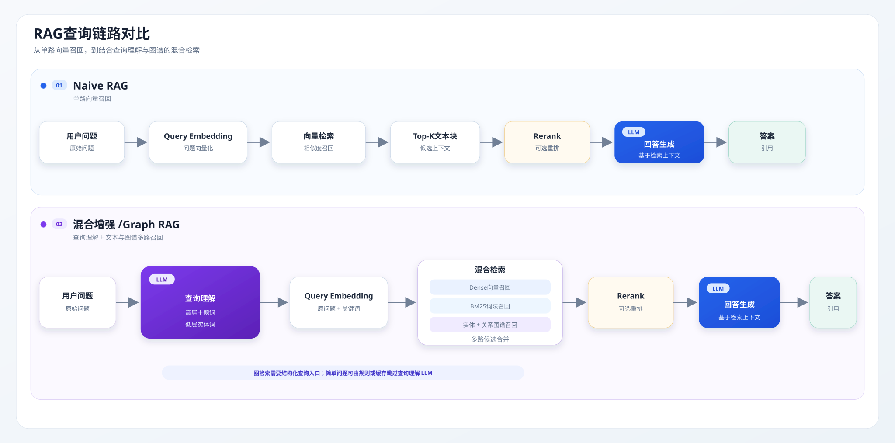

`Naive RAG` 与 `Graph RAG` 的核心区别在于**知识组织与检索方式**：

- `Naive RAG` 将文本切块后存入向量库，主要依赖文本检索与语义相似度匹配。
- `Graph RAG` 构建实体关系图谱，查询时结合图检索、向量检索与文本检索。

## 模型基准性能

| 模型 | 芯片 | 输入 / 输出 token | Prefill TPS | Decode TPS |
| --- | --- | ---: | ---: | ---: |
| Qwen2.5-3B (RKRAG) | RK182X | 128 / 128 | 1538.8 token/s | 103.97 token/s |
| Qwen3.5-2B | RK182X | 128 / 128 | 1613.7 token/s | 91.40 token/s |
| Qwen3.5-4B | RK1828 | 128 / 128 | 797.2 token/s | 50.86 token/s |

## 板端问答性能

> 问题：**“FT 测试中 USB 错误是为什么？”**

| 指标 | Naive RAG | Graph RAG | 差值 |
| --- | ---: | ---: | ---- |
| 系统首字时间 TTFT | 1447.8 ms | 2861.4 ms | +1413.6 ms |
| 总耗时 | 2906.7 ms | 4005.0 ms | +1098.3 ms |
| 全部 LLM 输入 token | 1613 | 1850 | +237 |
| 全部 LLM 输出 token | 142 | 158 | +16 |

| 阶段 | Naive RAG（2B） | Graph RAG（2B） | Naive RAG（4B） | Graph RAG（4B） | RKRAG |
| --- | ---: | ---: | ---: | ---: | ---: |
| 查询理解 LLM | 不调用 | 662 输入 / 41 输出 token；**921.1 ms** | 不调用 | 662 输入 / 37 输出 token；**1664.3 ms** | **~1300ms** |
| Embedding | 1 条 / 12 输入 token；**27.0 ms** | 3 条 / 34 输入 token；**79.8 ms** | 1 条 / 12 输入 token；**26.9 ms** | 3 条 / 30 输入 token；**78.7 ms** | **~200ms** |
| Rerank | 1 个候选 / 762 输入 token；**42.8 ms** | 6 个候选 / 2340 输入 token；**681.7 ms** | 1 个候选 / 762 输入 token；**42.8 ms** | 6 个候选 / 2340 输入 token；**681.5 ms** | 10个候选；**~1500ms** |
| 回答 LLM | 1613 输入 / 142 输出 token；**2654.1 ms** | 1188 输入 / 117 输出 token；**2111.4 ms** | 1613 输入 / 74 输出 token；**3545.3 ms** | 1188 输入 / 140 输出 token；**4380.3 ms** | **~3500ms** |

